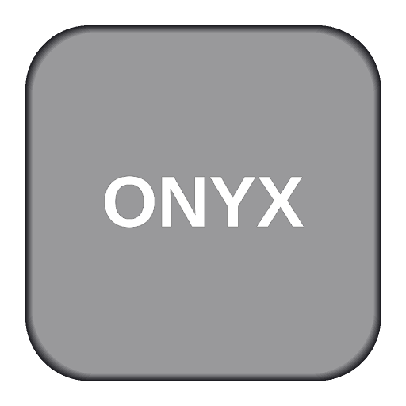

<p align="center">
  
</p>

<h1 align="center">Onyx</h1>

<p align="center">
  <strong>Turn a fresh Ubuntu install into a fully-configured dev machine with a single command.</strong><br/>
  <em>by artificial-softworks</em>
</p>

<p align="center">
  
  
  
</p>

---

## Quick Start

```bash
wget -qO- https://raw.githubusercontent.com/Vicjocaso/onyx-setup/master/boot.sh | bash
```

> **Note:** Onyx is designed for fresh Ubuntu 26.04 LTS installations only.

## What You Get

Onyx sets up a complete development environment with sensible defaults so you can start coding immediately.

### Core Apps

| Category | Apps |
|----------|------|
| **Browser** | Google Chrome |
| **Editor** | VS Code |
| **Terminal** | GNOME Terminal with CaskaydiaMono Nerd Font |
| **Containers** | Docker + LazyDocker |
| **Version Control** | Git + GitHub CLI |
| **Launcher** | Ulauncher |

### Optional Apps (you choose during install)

| App | Description |
|-----|-------------|
| Spotify | Music streaming |
| Discord | Voice, video & text chat |
| Steam | Gaming platform |
| Bitwarden | Password manager |
| TablePlus | Database management |
| Postman | API development platform |
| Bruno | Open-source API client |
| Warp | AI-powered terminal |
| OpenRGB | RGB lighting control |
| Cursor | AI code editor |
| Zed | High-performance editor |
| Antigravity | Google AI IDE with Gemini |

### Dev Languages (via mise)

- Node.js
- Go
- Python

### Databases (via Docker)

- PostgreSQL

### Web Apps

Installable as standalone Chrome apps with their own icon:

- ChatGPT
- Gemini
- Grok
- Google Photos
- Google Contacts

### GNOME Extensions

- **Tactile** — Window tiling with keyboard shortcuts
- **Just Perfection** — Shell UI tweaks
- **Blur My Shell** — Background blur effects
- **Space Bar** — Workspace indicator
- **TopHat** — CPU, RAM, disk & network monitor
- **Alphabetical App Grid** — Sort apps A-Z

### Themes

Onyx ships with multiple themes that change your desktop, terminal, and VS Code in one click:

- Tokyo Night
- Catppuccin
- Dracula
- Gruvbox
- Kanagawa
- Nord
- Rose Pine
- And more...

## Post-Install

After installation, open the **Onyx** app from your app grid or run:

```bash
onyx
```

From there you can:

- **Theme** — Change your entire look and feel
- **Font** — Switch terminal fonts
- **Update** — Update apps and system
- **Install** — Add more optional apps
- **Uninstall** — Remove apps cleanly
- **Manual** — Open documentation

## Requirements

- Ubuntu 26.04 LTS (fresh install recommended)
- Internet connection
- sudo access

## License

Onyx is released under the [MIT License](https://opensource.org/licenses/MIT).
